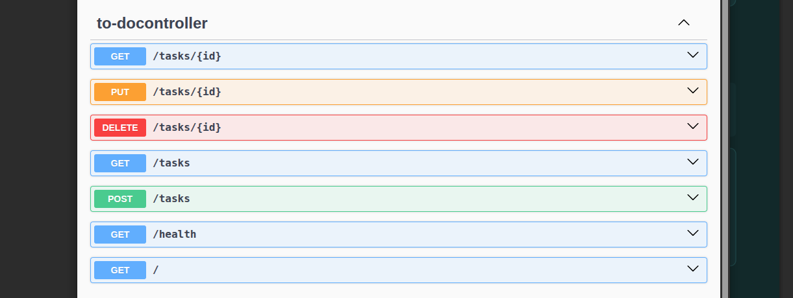

# To-Do CRUD API

A simple REST API for managing a to-do list.

This project was built as part of the **FlyRank Backend Internship – Week 2 Assignment** to practice the fundamentals of backend development, including **HTTP, REST APIs, CRUD operations, status codes, validation, Swagger UI, Git, and GitHub**.

The application currently stores tasks **in memory**, so the data will be reset whenever the server restarts.

## Features

* Create a new task
* Get all tasks
* Get a task by ID
* Update an existing task
* Delete a task
* Input validation
* Proper HTTP status codes
* Health check endpoint
* Interactive API documentation with Swagger UI

## Task Structure

Each task contains:

```json
{
  "id": 1,
  "title": "Learn REST APIs",
  "done": false
}
```

## API Endpoints

| Method   | Endpoint      | Description                      | Success Status   |
| -------- | ------------- | -------------------------------- | ---------------- |
| `GET`    | `/`           | Get API information              | `200 OK`         |
| `GET`    | `/health`     | Check whether the API is running | `200 OK`         |
| `GET`    | `/tasks`      | Get all tasks                    | `200 OK`         |
| `GET`    | `/tasks/{id}` | Get a task by ID                 | `200 OK`         |
| `POST`   | `/tasks`      | Create a new task                | `201 Created`    |
| `PUT`    | `/tasks/{id}` | Update an existing task          | `200 OK`         |
| `DELETE` | `/tasks/{id}` | Delete a task                    | `204 No Content` |

If a requested task does not exist, the API returns:

```http
404 Not Found
```

Invalid task data returns:

```http
400 Bad Request
```

## Running the Project

### Requirements

* Java 17+
* Maven

Clone the repository:

```bash
git clone <YOUR-GITHUB-REPOSITORY-URL>
cd <YOUR-REPOSITORY-NAME>
```

Run the application:

```bash
./mvnw spring-boot:run
```

The API will be available at:

```text
http://localhost:8080
```

## Swagger UI

Swagger UI provides interactive documentation where all API endpoints can be tested directly from the browser.

Open:

```text
http://localhost:8080/swagger-ui/index.html
```

### Swagger Screenshot



Using Swagger UI, you can perform the complete CRUD cycle:

1. Create a task with `POST /tasks`
2. View tasks with `GET /tasks`
3. Update the task with `PUT /tasks/{id}`
4. Delete the task with `DELETE /tasks/{id}`

## Example Request

Create a new task:

```bash
curl -i -X POST http://localhost:8080/tasks \
  -H "Content-Type: application/json" \
  -d '{"title":"Buy milk"}'
```

Example response:

```http
HTTP/1.1 201 Created
Content-Type: application/json

{
  "id": 4,
  "title": "Buy milk",
  "done": false
}
```

Get all tasks:

```bash
curl -i http://localhost:8080/tasks
```

Get a specific task:

```bash
curl -i http://localhost:8080/tasks/1
```

Delete a task:

```bash
curl -i -X DELETE http://localhost:8080/tasks/1
```

A successful delete returns:

```http
HTTP/1.1 204 No Content
```

## Validation

The API validates incoming task data.

For example, creating a task without a valid title is rejected:

```json
{
  "title": ""
}
```

The server responds with `400 Bad Request`.

The API also returns `404 Not Found` when a task ID does not exist.

## Technologies Used

* Java
* Spring Boot
* Spring Web
* Jakarta Validation
* Swagger / OpenAPI
* Maven
* Git
* GitHub

## What I Practiced

Through this project I practiced:

* Understanding the HTTP request-response cycle
* Designing REST API endpoints
* Implementing CRUD operations
* Working with path parameters and request bodies
* Validating client input
* Using HTTP status codes correctly
* Documenting and testing APIs with Swagger UI
* Using Git commits to track development progress
* Publishing a backend project to GitHub

## Assignment

**FlyRank Internship – Backend Track – Week 2**

**Assignment:** Build Your First CRUD API
